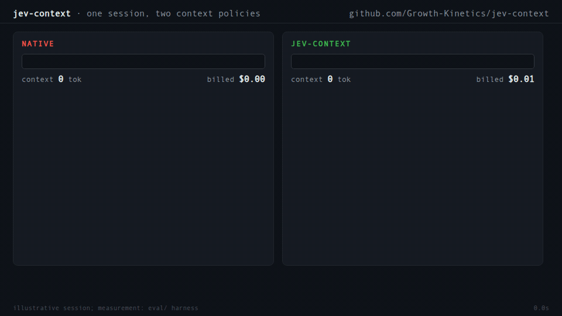

# jev-context

**We cut the context a coding agent carries by a third, not by summarizing the past but by
never loading the wrong things and deleting proven garbage. The judge that decides costs
two tenths of a cent per turn.**



This is an extension for [Pi](https://github.com/earendil-works/pi-mono), the terminal coding
agent. It replaces Pi's attention-based context policy with a scored one, using
[TypeSafe's Jev](https://docs.typesafe.ai), a System One model that returns calibrated
probabilities instead of prose. The reasoning model never sees a skill list to notice or a
tool catalog to browse. A cheap judge makes those calls, and code enforces them.

## The problem

A Pi session pays its full context on every model call. Eighteen installed skills means 18
descriptions in the system prompt, read on every turn, noticed unreliably (Pi's own docs admit
models often fail to load the skill they need). Tool schemas are worse: a typical MCP-heavy
setup ships 8-14k tokens of JSON Schema per call, most of it irrelevant to the current turn.
And tool outputs accumulate forever: the five greps that found nothing, the 200-line stack
trace, the file read that was superseded by an edit twenty turns ago. All of it is billed on
every call, and worse than billed: it acts as a wrong attractor, teaching the agent stale
state and abandoned approaches.

We measured before building. One of our sessions spent $0.28 on a single call because a cache
bust forced 83k tokens to recompute. That call paid for 6.6 million tokens of Jev judgment.

## Architecture: three nozzles, one judge

The extension hooks four Pi lifecycle events and makes three kinds of decisions.

**Nozzle 1: skill routing** (`before_agent_start`). On each user turn, the extension builds a
digest of the conversation (user turns plus assistant text and thinking, tool I/O excluded,
newest-first, capped at 80KB) and scores every not-yet-loaded skill against it. One request
per skill, all in parallel, each carrying the skill's *full body* rather than its description.
Skills scoring ≥ 0.6 (top-3 by score) are injected; the rest of the catalog never enters
context. Loaded skills are not re-scored; a decay re-check every fifth turn evicts what has
gone stale (floor 0.25). Manual `/skill:name` loads are pinned and exempt.

**Nozzle 2: tool surfacing** (same boundary, one batched call). You group peripheral tools
into namespaces in config (`browser_*`, `tavily_*`, your MCP servers). Jev scores each
namespace against the same digest; only active namespaces occupy schema tokens. A hardcoded
core (`read`, `write`, `edit`, `bash`, `grep`, `find`, `ls`) is always on. If the model calls
a surfaced-off tool anyway, Pi's unknown-tool error is detected and the namespace returns at
the next boundary, logged as `TOOL_SURFACE_MISS`.

**Nozzle 3: epoch pruning** (`agent_settled`). When a turn ends, Jev judges each tool
call/result pair of that turn with hindsight: "given how this turn concluded, is this output
helpful to subsequent turns?" Pairs at helpful-score ≤ 0.2 are removed from the context the
model sees. Verdicts are memoized by message id, so each pair is judged once, at the moment
its outcome is known. Judging happens while the user reads, not while the model works.

Two rules shape everything. **Mechanics in code, judgment in the model**: pair surgery,
caching, budget caps, and thresholds are deterministic TypeScript; relevance is Jev's. And
**keep the learning, trash the garbage**: pruning removes tool call/result pairs but never
the assistant's reasoning around them, because the reasoning is where "that path was a dead
end" lives. The on-disk transcript is never modified; pruning edits only the deep-copied
message list Pi hands to the `context` event.

## How we use Pi's seams

Pi's extension API turned out to have exactly the right joints. The `context` event delivers
a deep copy of the message list before every LLM call and accepts modifications, which makes
injection and pruning non-destructive by construction. `before_agent_start` fires once per
user turn, which is the only moment routing makes sense (tool-loop iterations don't change
what the user wants). `agent_settled` marks epoch close. Tool surfacing goes through
`getAllTools`/`setActiveTools`; manual overrides and stats are plain slash commands
(`/skill:name`, `/skill_stats`).

The extension is one file of erasable TypeScript with zero runtime dependencies. It loads
under Node's strip-types mode, tests run on `node:test` against a fixture server, and no test
touches the network. The quality contract (`VERIFYING.md`: biome with zero warnings, `tsgo`
with `erasableSyntaxOnly`, pinned-dependency ratchet, scenario-mirrored behavior tests) is
enforced by `npm run check && npm test`, which is also what our CI-equivalent GOAL loop ran
against every milestone.

## Cache discipline

Prefix caching is where naive context manipulation dies. Insert a message mid-history and
everything after the insertion point recomputes; do it every turn and you have invented a
very expensive heater. Our rules: injection happens at a fixed position (immediately after
the system prompt), content is byte-stable within an epoch, and the active set is frozen
between user turns. Routing and pruning decisions land at boundaries only, where the prefix
was going to change anyway because the user just typed. The result is that a governed session
keeps the same cache-hit shape as a native one, minus the weight it dropped.

## Numbers

Everything below comes from the harness in `eval/`, which replays real Pi session logs
through the three nozzles and counts what each arm would have billed. Corpora are
owner-local: point it at your own sessions (they live under `~/.pi/agent/sessions/`) and see
what you get. Ours:

**Golden set** (12 conversation-heavy sessions, 133 user turns, 1,662 model calls, 260M
billed context tokens at baseline): routing alone saves 33.9%; routing plus pruning saves
37.0%. Attribution: 80.2M tokens from skills not loaded, 8.2M from tool schemas not shipped,
7.9M from tool outputs pruned.

**Full corpus** (88 sessions, 22,578 calls, 6.5B billed tokens): 3.8%. The gap is the honest
part. Three quarters of those sessions have no recorded skill scores, so they run in our
fail-static mode, where the governor costs nothing and changes nothing; and the monster
sessions in the corpus carry ~4GB of image payloads that no text policy can shrink. Context
policy pays where context is conversation.

**Routing quality**, from a 12-session labeled eval (6 positive, 6 hard negatives, 19 skills,
full-body scoring): labeled-relevant skills scored 0.81-0.92; the 210 irrelevant judgments
had median 0.08, p90 0.43, max 0.92. The distributions overlap, which is why the policy is
threshold-plus-top-3 rather than a naked cutoff: the false-positive rate at 0.6 was 7.6%,
concentrated in broad-description skills that run hot, which per-skill thresholds then absorb.
A naked 0.5 would have shipped false confidence.

**Pruning quality** is the number we deliberately do *not* claim yet. Harness-mode pruning
uses a recurrence proxy (a tool never called again is dead weight), which is an upper bound,
not a measurement of Jev's live verdicts. The fixture reports zero false prunes by
construction. Live pruning accuracy is what the telemetry is for.

**Cost and latency.** Jev is billed on input only, $0.042 per million tokens, output free.
A turn in a long session routes 18 skills in parallel for ~53k input tokens: $0.0022 and
841ms, both off the critical path (the user is reading; the main model's time-to-first-token
is longer). A fresh-corpus eval run over the full golden set cost $1.69. Replays against the
recorded cache are free and byte-identical.

**Live shakedown** (this box, real sessions): a whiteboard prompt routed the tldraw skill at
0.98 against a next-best 0.10. A neutral prompt loaded nothing, max score 0.02. The pruner
judged a failed `cat` at 0.54 and kept it, correctly: an error message is a do-not-repeat
signal, and keeping it is the safe error.

## Failure behavior

If Jev is unreachable, over quota, or unconfigured, every nozzle fails static: skills behave
as Pi default, all tools visible, nothing pruned, one loud `ui.notify` plus a
`ROUTE_DEGRADED` telemetry line. The extension also cannot hold a session hostage: pruning
never touches the transcript on disk, so anything removed from context is recoverable by
re-reading the file.

## Telemetry

Every decision lands in `~/.pi/agent/jev-context-telemetry.jsonl` as structured JSON
(`ROUTE_DECISION`, `TOOL_SURFACE`, `PRUNE_JUDGED`, `PRUNE_EPOCH`, `ROUTE_DEGRADED`), with
scores, latencies, and token counts. `/skill_stats` renders aggregates in-session. Thresholds
are config, and the intended workflow is to tune them from your own telemetry after a few
days, not to trust ours.

## Install

```sh
pi install git:github.com/Growth-Kinetics/jev-context          # latest
pi install git:github.com/Growth-Kinetics/jev-context@v0.1.0   # pinned
```

Or manually: symlink `extensions/jev-context.ts` into `~/.pi/agent/extensions/`.

Configure in `~/.pi/agent/jev-context.json` (all fields optional):

```jsonc
{
  "apiKeyEnv": "PI_TYPESAFE_JEV",       // or "apiKeyFile": "~/.pi/agent/secrets/jev.key"
  "loadThreshold": 0.6,
  "topK": 3,
  "pruneThreshold": 0.2,
  "consoleLog": false,                   // true echoes judgment lines to stderr
  "toolNamespaces": {                    // your bundles; none are shipped
    "browser": { "prefix": "browser_" }
  }
}
```

Skill discovery scans Pi's canonical skill roots; add yours via `skillRoots`. A project-level
`.pi/jev-context.json` overrides user config.

## Data handling

Judging sends conversation digests and tool outputs to the configured TypeSafe endpoint over
HTTPS. That is the whole egress surface. The key is never logged, the transcript is never
written, and nothing is sent anywhere else. If your sessions are sensitive, read
`extensions/jev-context.ts` first; it is one file, and the network path is one function.

## Development

```sh
npm install --ignore-scripts
npm run check   # biome (zero warnings) + tsgo (erasableSyntaxOnly) + pinned deps + eval gate
npm test        # node --test, 102 tests, no network
```

`VERIFYING.md` is the binding contract. `eval/README.md` documents the harness. Built
autonomously by a GOAL loop of coding agents (kimi-coding/k3 and zai/glm-5.3) executing specs
against that contract, reviewed by fresh-eyes subagents per milestone; the process artifacts
are not in the repo, but the eval harness they built is how you should decide whether to
trust any of the above numbers.

## License

MIT
